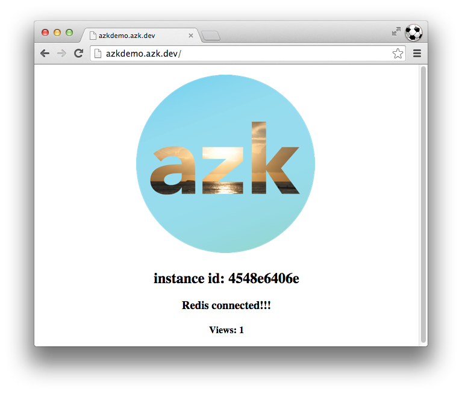

# Bancos de dados

Nossa aplicação mostra um simples contador de visitas, porém é preciso configurar um banco de dados onde a aplicação deve salvar a contagem de visitas.

Instalar e configurar um banco de dados no `azk` é realmente muito simples. Primeiro você deve editar o arquivo `Azkfile.js` e adicionar uma entrada de sistemas referente ao banco de dados:

```js
// Adds the systems that shape your system
systems({
  azkdemo: {
    // ...
  },
  // Adicione a entrada para o sistemas redis
  redis: {
    image: "dockerfile/redis",
    export_envs: {
      "DATABASE_URL": "redis://#{net.host}:#{net.port[6379]}"
    }
  }
});
```

Feito isso já é possível levantar e ter acesso ao banco de dados:

```bash
$ azk start redis
azk: ↑ starting `redis` system, 1 new instances...
azk: ✓ checking `dockerfile/redis:latest` image...
azk: ◴ waiting start `redis` system, try connect port 6379/tcp...

┌───┬────────┬────────────┬──────────┬─────────────────┬─────────────┐
│   │ System │ Instancies │ Hostname │ Instances-Ports │ Provisioned │
├───┼────────┼────────────┼──────────┼─────────────────┼─────────────┤
│ ↑ │ redis  │ 1          │ azk.dev  │ 1-6379:49157    │ -           │
└───┴────────┴────────────┴──────────┴─────────────────┴─────────────┘
```

# Configurando aplicação

Para que nossa aplicação de exemplo consiga conectar a banco de dados precisamos primeiro **instalar a biblioteca** de conexão ao banco de dados.

Devemos lembrar no `azk` a instalação de dependências é sempre feita em um "**ambiente isolado**", por isso vamos chamar o **shell** do `azk` para fazer a instalação:

```bash
$ azk shell azkdemo
[ root@3848e1df91cf:/azk/azkdemo ]$ npm install redis
npm WARN package.json azk-hello@0.0.1 No repository field.
redis@0.12.1 node_modules/redis
[ root@3848e1df91cf:/azk/azkdemo ]$ exit
```

# Conectado os sistemas

Uma vez que o banco de dados já esta instalado e já temos as dependências necessárias para acessa-lo, podemos configurar nossa aplicação. Edite o `Azkfile.js`:

```js
// Adds the systems that shape your system
systems({
  azkdemo: {
    // Dependent systems
    depends: ["redis"], // <= adicionar o redis
    // ...
  },
  redis: {
    // ...
  }
});
```

Pronto, agora basta reiniciar o sistemas "azkdemo" e o contador já deve aparecer:

```bash
$ azk restart azkdemo
azk: ↓ stopping `azkdemo` system, 2 instances...
azk: ↑ starting `azkdemo` system, 2 new instances...
azk: ✓ checking `dockerfile/nodejs:latest` image...
azk: ◴ waiting start `azkdemo` system, try connect port http/tcp...
azk: ◴ waiting start `azkdemo` system, try connect port http/tcp...

┌───┬─────────┬────────────┬────────────────────────┬────────────────────────────┬───────────────┐
│   │ System  │ Instancies │ Hostname               │ Instances-Ports            │ Provisioned   │
├───┼─────────┼────────────┼────────────────────────┼────────────────────────────┼───────────────┤
│ ↑ │ azkdemo │ 2          │ http://azkdemo.azk.dev │ 2-http:49164, 1-http:49163 │ 6 minutes ago │
└───┴─────────┴────────────┴────────────────────────┴────────────────────────────┴───────────────┘
```

Acessando [http://azkdemo.azk.dev](http://azkdemo.azk.dev), você deve obter:


