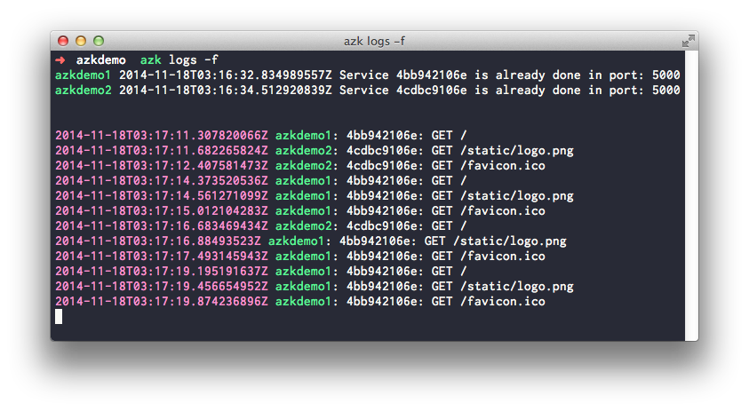

# Logs

Umas das coisas mais importante quando se esta desenvolvendo uma aplicação web é ter acesso aos logs. Para visualizar os logs da aplicação `azkdemo` faça:

```bash
$ azk logs -f
```

Acessando [http://azkdemo.azk.dev](http://azkdemo.azk.dev) algumas vezes, devemos obter um log parecido com:



