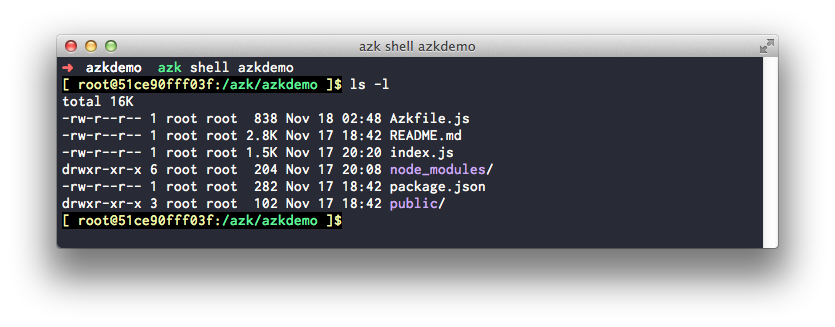

# Mapeando arquivos

Se observamos o `Azkfile.js` gerado é possível notar uma entrada no sistemas `azkdemo` chamada `mounts`:

```js
systems({
  azkdemo: {
    // ...
    command: "node index.js",
    mounts: {
      '/azk/#{manifest.dir}': path("."),
    },
    scalable: {"default": 2},
    // ..
  },
});
```

Esta entrada basicamente orienta o `azk` sobre quais arquivos locais devem estar disponíveis para sua aplicação no ambiente isolado onde ela ira rodar. No caso a pasta atual, ou seja pasta `azkdemo` vai estar disponível no path `/azk/azkdemo` dentro do ambiente isolado.

Se acessarmos o shell do sistema `azkdemo` é possível listar os arquivos da pasta `azkdemo` conforme o esperado:



Observe que ao chamar o `azk shell` você foi enviado a pasta `/azk/azkdemo`, esse path corresponde a entrada `workdir` do Azkfile.js, que tem o valor: `/azk/#{system.name}`.

Este `#{system.name}` nada mais é do que uma notação que permite saber o nome de um sistemas quando se esta declarando as opções desse mesmo sistemas. No exemplo o valor é expandido para `azkdemo`.

