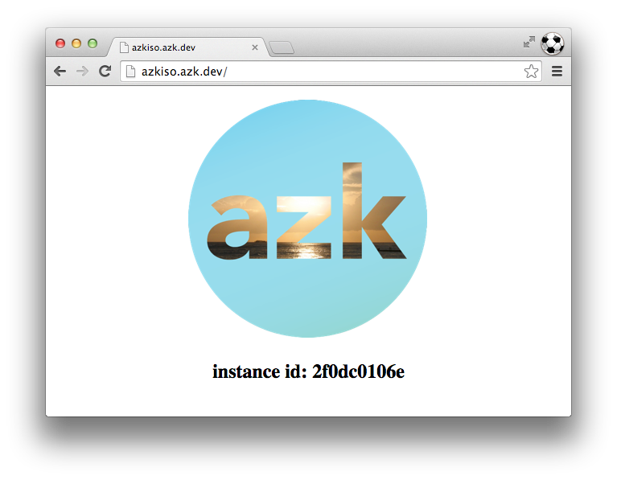

# Rodando a aplicação

Uma vez com o `Azkfile.js` criado, estamos prontos para levantar nossa aplicação:

```bash
$ azk start -vv
```

A saída do comando acima deve ser algo parecido com:

```bash
azk: ↑ starting `azkdemo` system, 2 new instances...
azk: ✓ checking `dockerfile/nodejs:latest` image...
azk: ⇲ downloading `dockerfile/nodejs:latest` image...
// download progress output...
  9a76e1635147: Download complete
azk: ↻ provisioning `azkdemo` system...
npm WARN package.json azk-hello@0.0.1 No repository field.
// long output
// download node dependences ...
azk: ◴ waiting start `azkdemo` system, try connect port http/tcp...
azk: ◴ waiting start `azkdemo` system, try connect port http/tcp...

┌───┬────────┬────────────┬───────────────────────┬────────────────────────────┬───────────────────┐
│   │ System │ Instancies │ Hostname              │ Instances-Ports            │ Provisioned       │
├───┼────────┼────────────┼───────────────────────┼────────────────────────────┼───────────────────┤
│ ↑ │ azkiso │ 2          │ http://azkdemo.azk.dev│ 2-http:49154, 1-http:49153 │ a few seconds ago │
└───┴────────┴────────────┴───────────────────────┴────────────────────────────┴───────────────────┘
```

Se tudo ocorreu conforme o esperado agora você pode acessar [http://azkdemo.azk.dev](http://azkdemo.azk.dev) e a seguinte tela deve aparecer:


